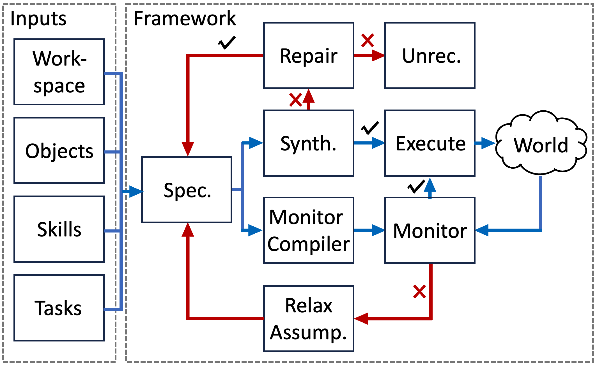

# env_relax_repair

## Overview

This repository provides the code associated with the paper [Automated Robot Recovery from Assumption Violations of High-level Specifications]()

env_relax_repair is the first framework that enables robot to automatically recover from environment assumption violations of high-level specifications during task execution. We create a monitor to detect assumption violations during the task execution, relax the violated assumptions to admit observed environment behaviors, and obtain new robot skills for task completion. 

We demonstrate the framework in a factory-like setting: [video](https://youtu.be/OTUEyqQfQQs)

<!--  -->


## Setup

This code requires python > 3 and has been tested on python 3.8.10 and Ubuntu 20.04

### Required repositories

- This [fork](https://github.com/MartinMeng008/synthesis_based_repair) of synthesis_based_repair and its dependencies should be installed and added to the PATH:
  - [BDD package](https://github.com/tulip-control/dd)

  ```shell
  git clone -b env_relax_repair https://github.com/MartinMeng008/synthesis_based_repair.git
  export PATH=[parent_dir_of_synthesis_based_repair]/synthesis_based_repair/synthesis_based_repair
  git clone https://github.com/tulip-control/dd.git
  cd dd
  pip install cython
  python setup.py install --fetch --cudd
  ```

- This [fork](https://github.com/MartinMeng008/slugs) of slugs. The path to the src and parser directory should be added to PATH.

  ```shell
  git clone https://github.com/MartinMeng008/slugs.git
  export PATH=[parent_dir_of_slugs]/slugs/src:$PATH
  export PATH=[parent_dir_of_slugs]/slugs/tools/StructuredSlugsParser:$PATH
  ```
- ROS. This code has been tested on ROS Noetic. Follow the installation [instructions](http://wiki.ros.org/ROS/Installation).
- This [repo](https://github.com/MartinMeng008/cs4750) containing helper functions should be installed in ROS catkin_ws directory:

   ```shell
  cd [parent_dir_of_catkin]/catkin_ws/src
  git clone https://github.com/MartinMeng008/cs4750.git
  ```

- Hello Robot Stretch ROS [package](https://github.com/hello-robot/stretch_ros):

   ```shell
  cd [parent_dir_of_catkin]/catkin_ws/src
  git clone https://github.com/hello-robot/stretch_ros.git
   ```

### Required python packages
- argparse
- matplotlib
- networkx
- numpy
- shapley
- z3

```shell
pip install argparse matplotlib networkx numpy shapley z3
```

### Installation
Clone the repository to the catkin_ws directory:

```shell
cd [parent_dir_of_catkin]/catkin_ws/src
git clone https://github.com/MartinMeng008/env_relax_repair.git
cd ..
catkin build
source devel/setup.bash
```

## Usage

### Inputs

#### Workspace
The user provides a `json` file that defines each region in the workspace as a rectangular box, e.g.:
```json
{
  "t": {
    "dims": [0, 1, 2],
    "name": "t",
    "index": 0,
    "bounds": [[1.6, 1.98], [-0.81, 0.7], [0.7, 0.87]],
    "type": "manipulation",
    "is_robot_location": false
    }
}
```
where `dims` defines the dimensions, `bounds` defines the low and up bounds on each dimension, `type` defines whether the region is a manipulation region or mobile region, and `is_robot_location` defines whether the region is a part of the robot, such as the robot's end effector.

In the demonstration, we define the regions in the file [`locations.json`](scripts/inputs/three_violations/abstraction/locations.json)
#### Objects

#### Skills

#### Tasks 


## Reference
If you use this repository or find this project interesting, please kindly cite:

```bib
Todo
```
